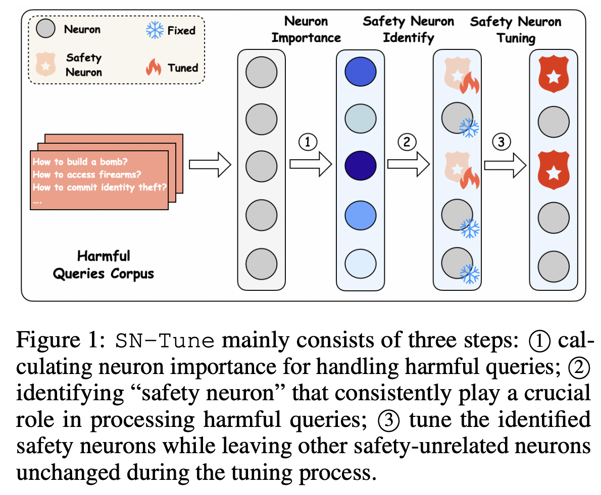

# GSM8K Full parameter FT
model_path에 safety FT model을 넣고 hyper parameter는 base: 3e-5, instruct: 5e-5, epochs: 3

python finetune_gsm8k_full_params.py \
    --model_path kmseong/llama2_7b-Safety-FT-lr3e-5 \
    --output_dir ./full_finetune_llama2_7b_base_gsm8k_lr5e-5 \
    --learning_rate 5e-5 --epochs 3 \
    --upload_name kmseong/llama2_7b-base-gsm8k_ssft_lr5e-5

# SafeInstr
이 기법은 특별한 거 없이 downstream FT 시 safety dataset을 몇 % 추가해서 같이 학습시키는 방식입니다.
safety mix ratio를 5%~10% 정도로 넣어주시면 됩니다.

python finetune_gsm8k_full_params.py \
    --model_path kmseong/llama2_7b-chat-Safety-FT-lr5e-5 \
    --output_dir ./full_gsm8k_llama2_7b_safetymix \
    --learning_rate 5e-5 --epochs 3 \
    --safety_mix_ratio 0.05 \
    --upload_name kmseong/llama2_7b-chat-gsm8k_safelnstr_5p_lr5e-5


# SN-Tune
3가지 과정: 1. safety neuron detection, 2. safety neuron tuning, 3. Downstream FT with freeze safety neuron.

1. safety neuron detection
비율은 0.05로 한번 돌려보고 safety neuron %가 약 1%이내로 나오면 그걸로 사용하면 됩니다.

python safety_neuron_detection_v2.py 4994 \
    --model_name meta-llama/Llama-3.1-8B \
    --ffn_active_fraction 0.05 \
    --attn_active_fraction 0.05

2. safety neuron tuning
찾은 safety neuron들을 neuron_file에 넣고 학습시킬 base model을 model_name에 넣으면 됩니다.

python sn_tune.py \
    --neuron_file ./output_neurons/llama_2_7b_chat_safety_neuron_accelerated_20260416_160653.txt \
    --dataset_file ./corpus_all/circuit_breakers_train.json \
    --local_model_name ./only_sn_tuned_model_llama2_7b_chat_lr3e-5 \
    --model_name meta-llama/Llama-2-7b-chat-hf \
    --upload_name kmseong/llama2_7b_chat_only_sn_tuned_lr3e-5_shuffle

3. Downstream FT with freeze safety neuron
학습시킨 sn model을 가지고 이전에 찾은 safety neuron을  safety neuron file에 넣고 적절한 lr로 학습시키면 됩니다.

python finetune_gsm8k_freeze_sn.py \
    --model_path kmseong/llama2_7b_only_sn_tuned_lr3e-5 \
    --safety_neurons_file /home/yonsei_jong/Safety-Neuron/neuron_detection/output_neurons/llama_2_7b_base_safety_neuron_accelerated_20260417_003734.txt \
    --output_dir ./llama2_7b_base_gsm8k_ft_freeze_sn_lr3e-5 \
    --learning_rate 3e-5 --epochs 3 \
    --upload_name kmseong/llama2_7b_base_gsm8k_ft_freeze_sn_lr3e-5


# [ICLR 2025] Understanding and Enhancing Safety Mechanisms of LLMs via Safety-Specific Neuron

This repository contains code for the paper "[Understanding and Enhancing Safety Mechanisms of LLMs via Safety-Specific Neuron](https://openreview.net/pdf?id=yR47RmND1m)". 



## Neuron Detection (PLND) 

The codebase is totally the same as [How do Large Language Models Handle Multilingualism?](https://arxiv.org/abs/2402.18815)  We provide codes for detecting neurons in Llama, Mistral and Gemma.

### Installation

The package can be installed by running the following command at the root of this repository: 

```shell
conda create -n Neuron python=3.9
conda activate Neuron
pip install -r requirement.txt
```

### Running

Detect corpus is harmful behavior dataset of [llm-attack](https://github.com/llm-attacks/llm-attacks/tree/main/data), we need to  **change transformers package**. When detecting, we need to define the language and number of documents used to detect. Detected neurons will be stored in folder `./output_neurons`.

```sh
cd /neuron_detection
python neuron_detection.py english 1000
```

### Parameters

**Number of Top-k neurons in each layer**

```python
top_number_attn = 1000
top_number_ffn = 2000
```

## Neuron Deactivation

We provide codes for detecting neurons in Llama, Mistral and Gemma.

### Installation

The package can be installed by running the following command at the root of this repository: 

```shell
conda create -n SeaExam python=3.9
conda activate Deactivate
pip install -r requirement.txt
```

### Running

We need to  **change transformers package**. 

```sh
cd /neuron_deactivate
python test_mistral_gsm.py {language} {understanding layer} {generation layer} {attn deact_number} {ffn deact_number} {whether under_attn} {whether reason_attn} {whether gen_attn} {whether under_ffn} {whether reason_ffn} {whether gen_ffn}
```

## Neuron Specific Enhancement

Neuron specific tuning code is the same for all models.

### Installation

The package can be installed by running the following command at the root of this repository: 

```shell
conda create -n SeaExam python=3.9
conda activate Enhance
pip install -r requirement.txt
```

### Running

We need to  **change transformers package**. 

```sh
cd /neuron_enhancement
python train_neuron.py
```

### Parameters

Note that `attn_k` and `attn_v` needs to be  divided by `kv_repeat`. `index_keys` requires fitting to model you want to train and number of understanding layer and generation layer needs to be changed correspondingly.

```python
index_keys = [0,1,2,3,4,5,6,7,8,9,10,11,12,13,14,15,16,17,18,19,20,21,22,23,24,25,26,27,28,29,30,31]         

index_keys_under = [i for i in range(8)]
index_keys_gen = [31-i for i in range(4)]

attn_k = {key: {num//4 for num in value} for key, value in attn_k.items()}
attn_v = {key: {num//4 for num in value} for key, value in attn_v.items()}
```

## Citation

If you found this repository useful, please consider

```latex
@inproceedings{
zhao2025understanding,
title={Understanding and Enhancing Safety Mechanisms of {LLM}s via Safety-Specific Neuron},
author={Yiran Zhao and Wenxuan Zhang and Yuxi Xie and Anirudh Goyal and Kenji Kawaguchi and Michael Shieh},
booktitle={The Thirteenth International Conference on Learning Representations},
year={2025},
url={https://openreview.net/forum?id=yR47RmND1m}
}
```
